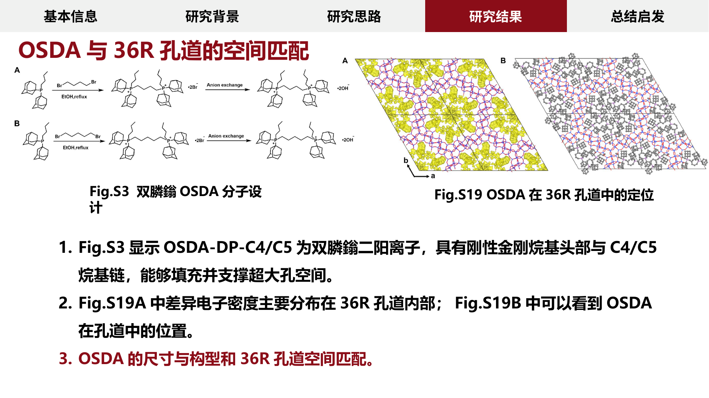
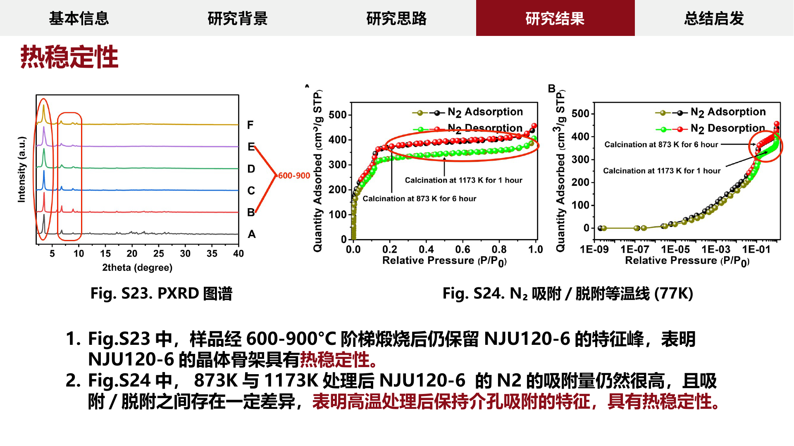
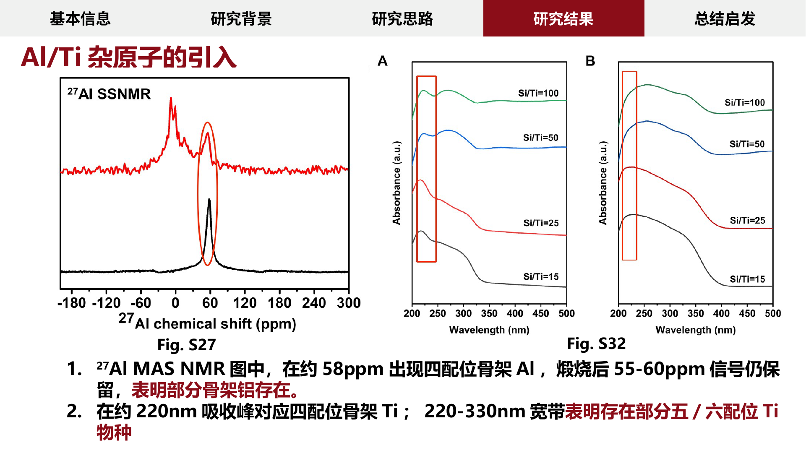
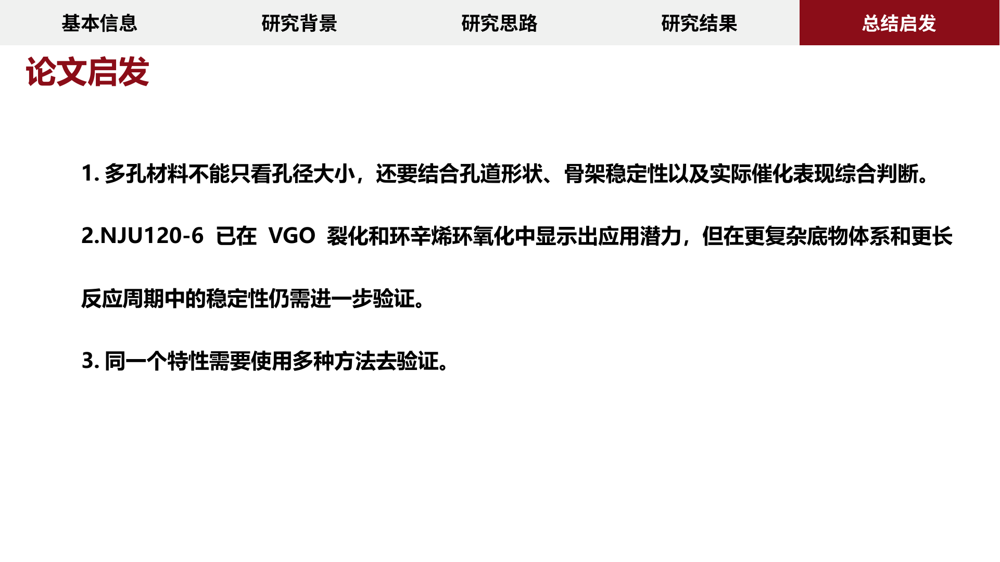

# academic-slide-minimalist

把论文和补充信息读透，再生成一套能讲清楚证据链的中文文献汇报 PPT。

[English](docs/README.en.md) | 中文

[](LICENSE)
[](academic-slide-minimalist/SKILL.md)
[](academic-slide-minimalist/assets/sample-literature-report.pptx)
[](README.md)

`academic-slide-minimalist` 是一个面向 Claude Code / Codex 的学术 PPT skill。它适合论文组会、journal club、课程文献汇报、硕博答辩预汇报等场景：先做 close reading、证据链梳理、真实图源清单和页面规划，再用 image-first 方式生成稳定的 16:9 PPT 页面。

它的核心原则很简单：**清楚先于好看，真实先于炫酷**。

---

## 效果演示

下面的页面来自仓库内置样例 `academic-slide-minimalist/assets/sample-literature-report.pptx`，用于展示 skill 追求的页面组织方式：真实论文图、清晰结论句、红黑灰学术风格、导航一致、证据链可讲。

### 证据链整合页



这类页面适合把多个表征结果和催化结果放在同一页里，强调“迁移证据 -> 性能变化 -> 本页结论”的因果链。页面重点不是堆图，而是让听众知道每张图回答了什么问题。

### 对比结论页



这类页面适合从多组对照中提炼 2-3 个核心结论。右侧结论块把图中的趋势转成可讲述的判断，底部红条负责压住本页主结论。

### 参数窗口页



这类页面适合解释“不是越多越好”的实验窗口：左侧说明不足，右侧说明过量，中间窗口给出最优区间。适合用于剂量、比例、温度、时间、负载量等变量讨论。

### 机理证据页



这类页面适合展示直接机理证据。图中保留真实谱图和关键峰位，通过框线、箭头、编号解释和底部结论把实验现象转成机制判断。

---

## 这个 skill 解决什么问题

很多 AI PPT 工具能把页面做得好看，但学术汇报最容易翻车的地方不是配色，而是：

- 没读懂论文主线，只是按 Figure 1、Figure 2 顺序堆图；
- 用了“看起来像实验图”的假图或重绘图，科学内容不可信；
- 页面标题是主题词，不是结论句，汇报时讲不出核心观点；
- 结果部分全部塞进“研究结果”，老师听不出证据层次；
- PPT 页面单独生成，导航、页码、标题尺度和图注风格不一致；
- 汇报完成后缺少 backup、问答准备和可追溯的图源记录。

`academic-slide-minimalist` 的目标是反过来做：先保证论文逻辑、图源和证据强度正确，再追求页面美观。

---

## 核心能力

### 1. 论文到 PPT 的完整工作流

从 main paper + supplementary information 出发，按固定顺序生成汇报结构：

```text
close reading
-> paper logic tree
-> terminology table
-> main/SI evidence crosswalk
-> figure source manifest
-> adaptive navigation
-> deck order map
-> page briefs
-> image2 page generation
-> PPTX assembly
-> render audit / Q&A prep
```

这不是简单摘要，而是把论文论证链变成可讲、可问答、可追溯的页面序列。

### 2. 真实图源优先

科学视觉只能来自论文主文图、supplementary information / supporting information，以及用户上传的截图、原始图或已有 PPT 页面。

禁止生成或重绘实验数据图，包括分子结构、晶体结构、谱图、显微图、XRD/NMR/IR/Raman/TG/DSC、吸附曲线、反应机理、性能图表等。允许的操作只包括裁剪、放大、对齐、遮边、加框、箭头、标签和短注释。

### 3. 自适应导航，而不是固定模板

默认样例节奏可以是：

```text
封面 -> 基本信息 -> 研究背景 -> 研究思路 -> 研究结果 -> 总结启发 -> 汇报完毕
```

但真正生成时会根据论文领域和证据链拆分导航。比如催化/材料论文可能拆成：

```text
基本信息 | 研究背景 | 设计策略 | 性能验证 | 结构证据 | 机理解释 | 总结启发 | Backup
```

算法论文、生命科学论文、综述论文也会使用不同的导航语法，避免所有论文都被塞进同一套“研究结果”里。

### 4. image-first 稳定出稿

默认使用 image2 思路：每一页先生成完整 16:9 页面图，再插入 PPTX。这样能最大限度避免文本框跑版、字体替换、元素错位和跨设备渲染问题。

如果用户明确要求可编辑版本，skill 会切换到 editable output 相关流程，但不会假装已经产出可编辑 PPT。

### 5. 质检和答辩准备

内置 references 覆盖页面顺序和主线检查、图源 manifest、图像可读性标准、术语一致性、证据强度分级、backup slides、老师可能追问的问题、最终交付预览和渲染审计。

---

## 适合谁用

- 需要做中文文献汇报的本科生、研究生和科研人员；
- 需要把一篇论文讲成 20 页以上组会 PPT 的用户；
- 已经有样例 PPT，希望 AI 按样例节奏重构新论文汇报的人；
- 对“不能造假图”“必须引用真实论文图”要求很高的学术场景；
- 需要先诊断已有 PPT，再局部重画或重排整套汇报的人。

不适合：一键商业路演 PPT、纯视觉概念页、伪造实验数据、重绘论文图，或生成“看起来像论文图”的假图。

---

## 安装

### 方式一：让 AI 助手安装

把下面这段发给你的 Codex / Claude Code：

```text
帮我安装这个 Codex skill：
https://github.com/fangyuanopus/literature-report-ppt-builder

安装到我的本地 skills 目录，并告诉我重启后应该怎么调用。
```

### 方式二：手动安装到 Codex

```powershell
git clone https://github.com/fangyuanopus/literature-report-ppt-builder.git
cd literature-report-ppt-builder
Copy-Item -Recurse .\academic-slide-minimalist "$env:USERPROFILE\.codex\skills\academic-slide-minimalist"
```

重启 Codex 会话后，skill metadata 会被重新发现。

### 方式三：手动安装到 Claude Code

```bash
git clone https://github.com/fangyuanopus/literature-report-ppt-builder.git
cd literature-report-ppt-builder
mkdir -p ~/.claude/skills
cp -R academic-slide-minimalist ~/.claude/skills/academic-slide-minimalist
```

---

## 怎么用

安装后直接用自然语言触发即可。

### 从论文生成完整文献汇报

```text
使用 academic-slide-minimalist，把这篇 main paper 和 SI 做成一套中文文献汇报 PPT。
要求至少 20 页，只使用论文和 SI 的真实图片，先梳理论文逻辑和页面顺序，再生成 PPT。
```

### 按样例 PPT 的节奏重构

```text
按照我给的样例 PPT 的页面节奏和红黑灰学术风格，重构这篇论文的文献汇报。
导航不要硬套模板，要根据论文证据链自适应拆分。
```

### 诊断已有 PPT

```text
先诊断我这个已有文献汇报 PPT 的问题：
检查主线、页面顺序、导航、图像可读性、标题结论性和答辩风险。
然后把页面分成必须重画、局部修复、可以保留三类。
```

### 逐段精读论文

```text
用 academic-slide-minimalist 的 close reading 模式，逐段翻译并讲解这篇论文。
每次只处理一个原文段落，等我说“继续”再进入下一段。
```

---

## 输出物

根据任务复杂度，skill 会生成或维护这些中间产物：

```text
paper_logic_tree.md
terminology_table.md
main_si_crosswalk.md
figure_source_manifest.md
adaptive_navigation_plan.md
deck_order_map.md
slide_outline.md
page_briefs.md
image2_generation_plan.md
image_generation_status.md
speaker_notes.md
quality_check_report.md
deck_diagnosis_report.md
redraw_priority_plan.md
final_delivery_preview.md
final_presentation.pptx
```

默认最终交付是稳定的 image-first PPTX。复杂任务也建议保留 `figure_source_manifest.md` 和 `deck_order_map.md`，方便答辩前回查每一页图和结论来自哪里。

---

## 项目结构

```text
academic-slide-minimalist/
  SKILL.md
  agents/
    openai.yaml
  assets/
    sample-literature-report.pptx
  references/
    close-reading-rules.md
    paper-to-ppt-workflow.md
    adaptive-navigation.md
    deck-order-map.md
    figure-source-manifest.md
    quality-gates.md
    ...
docs/
  README.en.md
  images/
    demo-evidence-chain.png
    demo-comparison-summary.png
    demo-parameter-window.png
    demo-ftir-mechanism.png
```

`SKILL.md` 是入口和总流程。`references/` 采用 progressive disclosure：只有在对应阶段才读取具体文件，避免一次性把所有规则塞进上下文。

`assets/sample-literature-report.pptx` 是风格和节奏参考，不是科学证据来源。做新论文时必须重新从该论文和 SI 提取真实图源。

---

## 内置参考模块

| 模块 | 用途 |
| --- | --- |
| `close-reading-rules.md` | 逐段精读、翻译、术语保持和深度解读 |
| `paper-to-ppt-workflow.md` | 从论文到 PPT 的主流程 |
| `adaptive-navigation.md` | 根据领域和证据链生成导航 |
| `deck-order-map.md` | 锁定页序、章节、标题、图源和 backup 状态 |
| `figure-source-manifest.md` | 记录每张图来自哪里、支撑什么结论 |
| `page-brief-template.md` | 每页生成前的页面 brief |
| `quality-gates.md` | 最终质检标准 |
| `question-prep.md` | 准备老师/导师可能追问的问题 |
| `backup-slides.md` | 判断哪些内容放入 backup |

---

## 与普通 AI PPT skill 的区别

| 维度 | 普通 PPT 生成 | academic-slide-minimalist |
| --- | --- | --- |
| 优先级 | 视觉优先 | 论文逻辑和证据优先 |
| 图像来源 | 可能生成概念图 | 只允许真实论文/SI/用户图 |
| 页面组织 | 常按 figure 顺序堆叠 | 按问题、策略、证据、机制、启发组织 |
| 导航 | 固定模板 | 按论文领域自适应 |
| 输出稳定性 | 可编辑但易跑版 | 默认 image-first 稳定页面 |
| 答辩准备 | 通常没有 | 包含 speaker notes、backup、Q&A 风险 |

---

## 验证 skill

如果你本地有 Codex 的 `skill-creator` 系统 skill，可以运行：

```powershell
$env:PYTHONUTF8 = "1"
python "$env:USERPROFILE\.codex\skills\.system\skill-creator\scripts\quick_validate.py" .\academic-slide-minimalist
```

通过时会输出：

```text
Skill is valid!
```

---

## 社区与致谢

- [LINUX DO](https://linux.do/)
- [JuneYaooo/gpt-image2-ppt-skills](https://github.com/JuneYaooo/gpt-image2-ppt-skills)

本项目认可并感谢 LINUX DO 社区在中文开发者开源交流、项目分享和技术讨论中的价值。除非社区另有明确说明，此处仅为社区致谢和链接，不代表官方背书。

README 的展示组织方式参考了开源社区中优秀的 skill 项目写法，特别是 `gpt-image2-ppt-skills` 对“效果图 + 安装 + 使用示例”的呈现方式。

---

## 开源说明

这个仓库开放的是 skill 工作流、提示规则、参考模板和样例节奏。使用者仍需自行确认论文、SI、截图和样例 PPT 的使用权限，以及课堂、组会或公开演讲场景下对论文图片的引用要求。

本项目不鼓励也不支持伪造实验数据、伪造论文图或生成误导性科学结论。

---

## License

MIT License. See [LICENSE](LICENSE).
