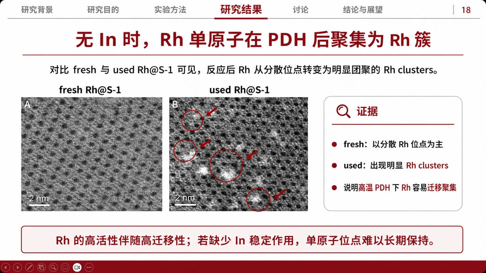
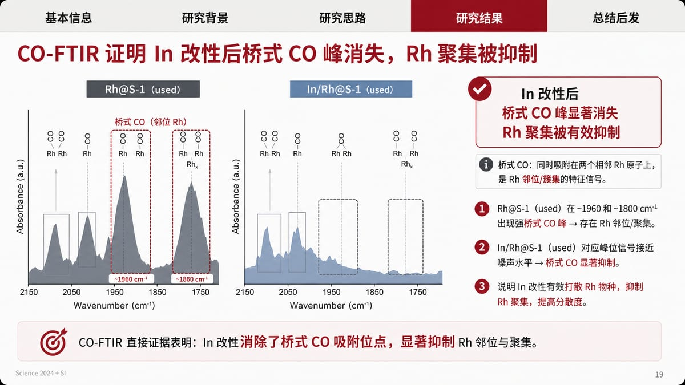
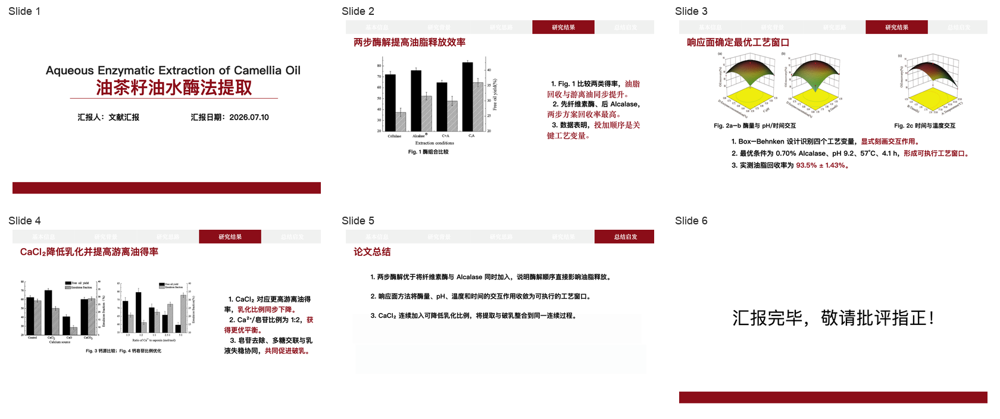
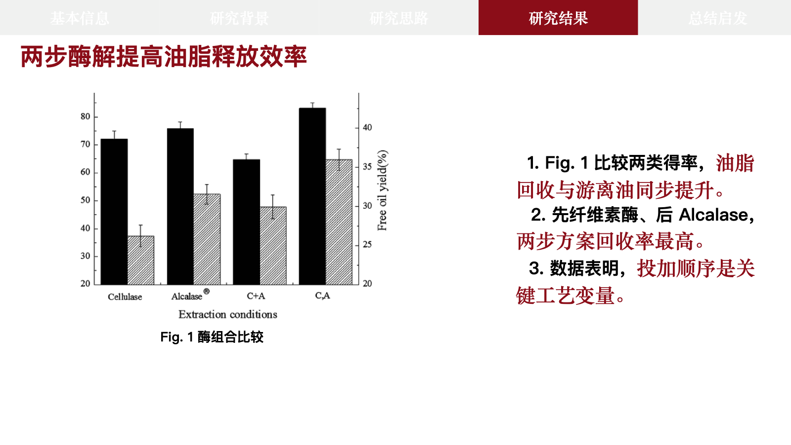
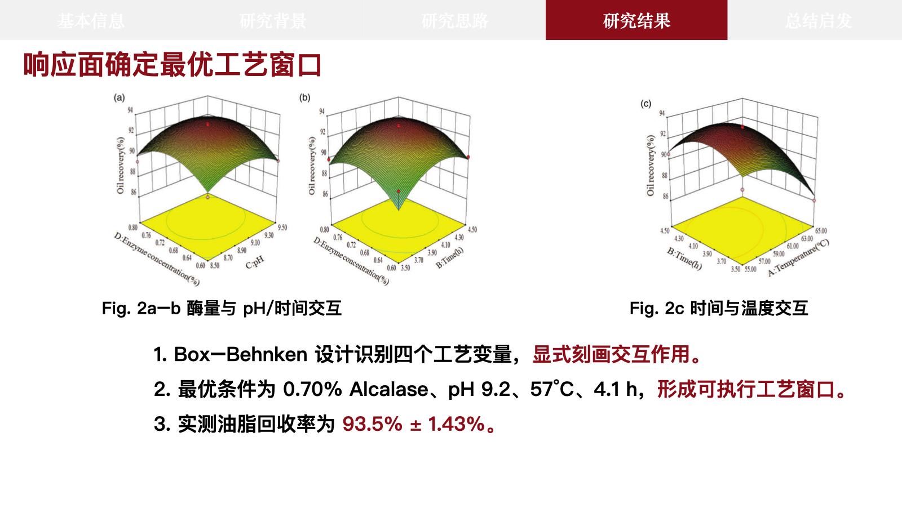

# Literature Report PPT Builder

Turn a paper's argument, real figures, and defensible conclusions into a Chinese literature-report deck. The maintained entry point is [academic-slide-pragmatic-fallback](../skills/academic-slide-pragmatic-fallback/SKILL.md).

English | [中文](../README.md)

[](../LICENSE)
[](../skills/academic-slide-pragmatic-fallback/SKILL.md)
[](../skills/academic-slide-pragmatic-fallback/assets/sample-literature-report.pptx)

Core principle: **real evidence first, explicit delivery route, and no confusion between Image2 output and editable code output.**

## Analyze the paper before generating slides

This skill does not send a PDF summary directly into a template. A full task first creates and validates `paper_analysis.json`, an evidence contract that every downstream slide plan must follow:

```text
main paper + SI
  -> logic tree
  -> figure records with evidence boundaries
  -> evidence chains
  -> navigation and slide plan
  -> Route A / B / C generation and QA
```

Each evidence-led slide must point back to a declared evidence chain and real figure. Each figure records its source file, PDF page, printed label, direct observation, and what it cannot establish alone. This prevents attractive but unsupported slides and claim drift during refinement.

```bash
python skills/academic-slide-pragmatic-fallback/scripts/validate_paper_analysis.py \
  paper_analysis.json --out paper_analysis_validation.json --fail-on-review
```

See the [analysis contract](../skills/academic-slide-pragmatic-fallback/references/paper-analysis-contract.md) and its [validated example](../skills/academic-slide-pragmatic-fallback/references/paper-analysis.example.json).

## Choose a delivery route first

| Route | Deliverable | Editable | Use when |
| --- | --- | --- | --- |
| A. GPT-image-2 / Image2 full-slide route | An approved full-slide image per page, then packaged into PPTX | Usually no object-level editing | A full-slide Image2 backend is confirmed and can preserve supplied paper crops faithfully |
| B. Exact-template code route | Inherit the bundled PPT master's chrome, navigation, footer, and slots, then replace them with current-paper content | Yes | The user explicitly wants the bundled template reproduced and accepts its fixed navigation semantics |
| C. Pragmatic code fallback | Create editable pages from a blank canvas using the bundled red/black/gray visual grammar | Yes | Image2 is unavailable and no clean template can be inherited |

Every route uses only scientific visuals from the paper, SI, or the user. It never generates, redraws, or changes the meaning of scientific data figures, spectra, microscopy, structures, tables, or mechanisms.

## Two demo sets for two different routes

### GPT-image-2 / Image2 full-slide visual demos

These pages were produced with the earlier GPT-image-2 / Image2-style full-slide route. They demonstrate the visual ceiling of an image-first delivery, not the editable code-template route.





### Code-generated editable exact-template demo

These pages are from the current code route: real Camellia oil paper figures were inserted into inherited template objects, and the deck passed build, structural, and template-fidelity audits. This is not a GPT-image-2 output.







The screenshots show the boundary of this route: navigation, titles, margins, footer, paragraphs, and red emphasis runs come from the original PPT; scientific figures are deterministic crops from the source PDF. The repository keeps preview images rather than redistributing the complete test-paper PPTX and its underlying figure assets.

## What the code route reliably does

With the bundled template and real source figures available, it reliably:

- selects and reorders distinct template source slides while preserving their master, navigation, title, footer, and whitespace rhythm;
- replaces text, captions, images, and multi-paragraph body copy while retaining inherited paragraph and black/red emphasis-run formatting;
- renders, trims, contains, and checks real PDF figures deterministically;
- removes stale media relationships, notes, notes masters, sections, unused masters/layouts, and old document metadata;
- produces an editable PPTX with a build report, structural audit, template-fidelity audit, and page-by-page preview.

It does not claim to:

- pixel-copy an arbitrary, unknown PPT without an inherited template;
- clone one source slide indefinitely to create extra pages (the stable implementation maps each output page to a distinct source page);
- convert every user PPT with locked objects or unknown masters into an exact editable template;
- generate, fill in, or redraw scientific data;
- call an Image2 full-slide bitmap an object-editable PPT.

Route C can reliably create clean editable academic pages in the sample's visual grammar, but it must not be described as an exact reproduction of the template.

## Invocation examples

### Let the skill choose the valid route

```text
Use academic-slide-pragmatic-fallback to build a Chinese literature-report PPT from this paper and SI.
Use only real paper figures. First create and validate paper_analysis.json, then derive the evidence chain, navigation, and deck order from it. If Image2 is unavailable, ask for my consent before choosing an inherited-template code route or pragmatic code fallback.
```

### Require GPT-image-2 / Image2 full-slide delivery

```text
Use academic-slide-pragmatic-fallback with a confirmed GPT-image-2 / Image2 full-slide backend.
Preserve supplied real paper figure crops, and deliver image2_manifest.json plus image-only validation.
```

### Require an editable reproduction of the bundled template

```text
Use academic-slide-pragmatic-fallback in exact-template code mode.
Inherit objects from sample-literature-report.pptx, replace every prior-paper object with real current-paper content, and complete structural, fidelity, and rendered-slide QA.
```

## Exact-template quality gates

An exact-template deck must pass all of these:

1. `build_fallback_template_pptx.py --strict --fail-on-warnings`;
2. `audit_fallback_template_pptx.py --check-masters --exact-template --fail-on-review`;
3. `audit_exact_template_fidelity.py --plan ... --build-report ... --fail-on-review`;
4. rendered comparison with the source template for navigation, titles, margins, footer, figure frames, and whitespace;
5. no legacy paper images, notes, sections, unused masters/layouts, duplicate ZIP parts, or stale document metadata.

## Installation

### Codex

```bash
git clone https://github.com/fangyuanopus/literature-report-ppt-builder.git
cp -R literature-report-ppt-builder/skills/academic-slide-pragmatic-fallback \
  ~/.codex/skills/academic-slide-pragmatic-fallback
```

Restart Codex, then invoke the skill in natural language.

### Claude Code

```bash
git clone https://github.com/fangyuanopus/literature-report-ppt-builder.git
mkdir -p ~/.claude/skills
cp -R literature-report-ppt-builder/skills/academic-slide-pragmatic-fallback \
  ~/.claude/skills/academic-slide-pragmatic-fallback
```

## Traceable outputs

For a non-trivial deck, keep at least:

```text
deck_order_map.md
paper_analysis.json
paper_analysis_validation.json
figure_source_manifest.md
page_briefs.md
fallback_edit_plan.json
prepared_figure_manifest.json
fallback_build_report.json
structural_audit.json
fidelity_audit.json
rendered_slides/
contact_sheet.png
final_presentation.pptx
```

The Image2 route additionally requires `image2_manifest.json`. The code route requires the template slot map, build report, and both audits. Do not mix their validation claims.

## Repository layout

```text
skills/
  academic-slide-pragmatic-fallback/   # maintained entry: Image2, exact-template, pragmatic fallback
    scripts/validate_paper_analysis.py # validates paper-to-evidence-to-slide references
docs/images/
  demo-slide-*.jpg                     # GPT-image-2 / Image2 full-slide demos
  demo-code-template-*.png             # code-generated, inherited-template demos
academic-slide-minimalist/              # retained compatibility entry; not the current code route
```

## Acknowledgements

- [JuneYaooo/gpt-image2-ppt-skills](https://github.com/JuneYaooo/gpt-image2-ppt-skills)
- [LINUX DO](https://linux.do/)
